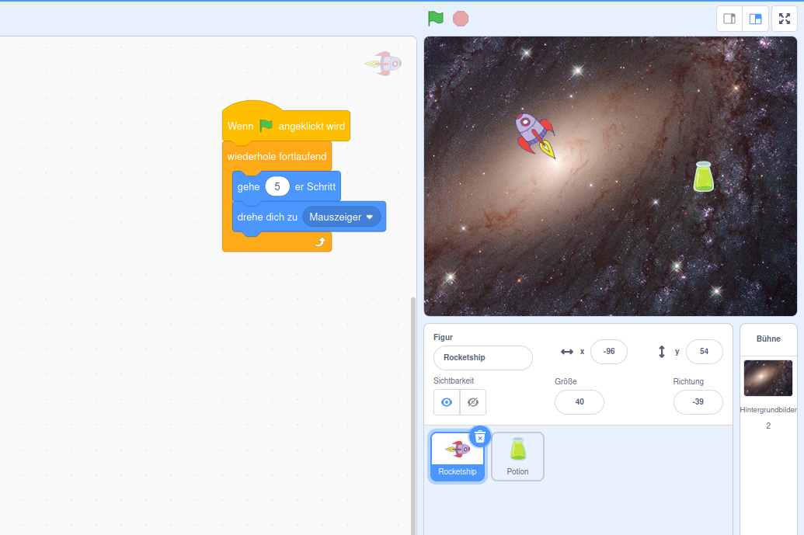
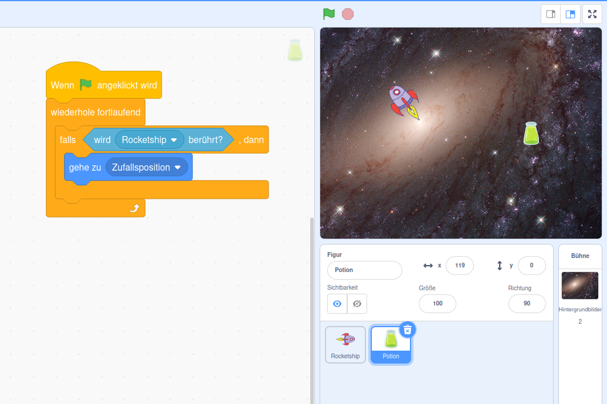
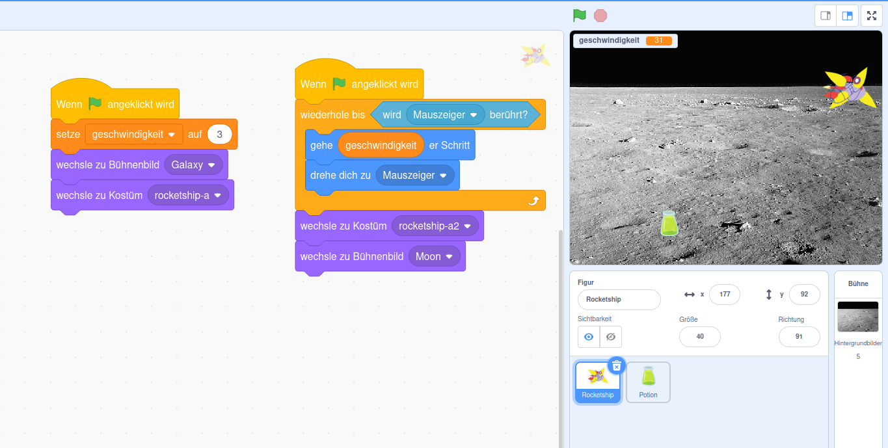
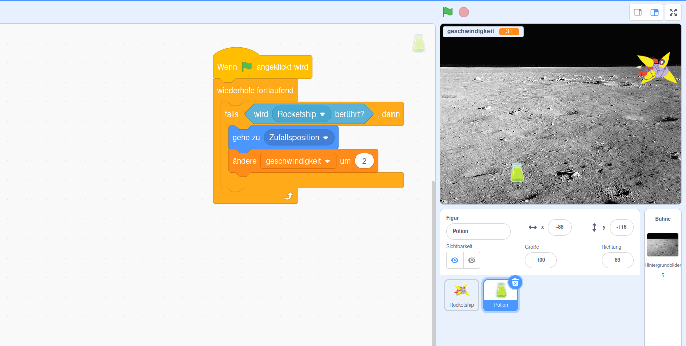

IDE: https://scratch.mit.edu  > beginne mit dem erstellen  
Zielalter: 8 bis 12 Jahre

# Sammelspiel

Vorstellungsrunde
- Name
- Alter
- Lieblingsspiel

## Dinge Erstellen
Jeder darf eigene Charaktere selber malen

Wir brauchen
- Spieler (Rakete, Katze, ...) 
    - beim Malen: rechts ist vorne!
- Gegenstand (Tank, Maus, ...)
- Hintergrund (Weltall, Grass, ...)

## Programmieren

### Basic Rakete
1. gehe 10er Schritt
2. endlos Schleife
    - gehe endlos (vtl kleinere Schritte)
3. schaue immer zum Mauszeiger

### basic Item
1. gehe zu zufälliger Position
    - kann man in Menü links ausführen zum sehen was das macht
2. ein ne Endlosschleife
3. blöd, wollen wir nur machen wenn die Rakete den Tank berührt
    - if bedingung erklären: falls rakete berührt wird 

### Weitere Ideen
Variable für Geschwindigkeit
- wird immer schneller, wenn mehr eingesammelt wird

Spiel ist vorbei wenn Rakete Mauszeiger berührt
- wiederhole bis Mauszeiger berührt

Variable für Score

verschiedene Tränke

Ton Effekte
- spiele Ton Befehl ist blokierend im Programmablauf!